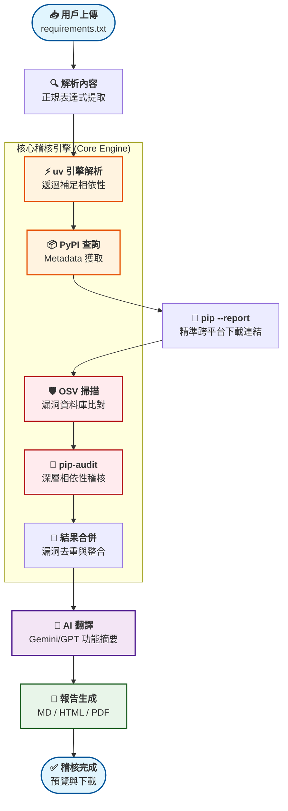

# 🔒 Python Dependency Auditor V1.2


自動化 Python 套件資安稽核工具。專為企業環境設計，提供專業的淺色 UI 介面，解析 `requirements.txt` 後會自動補齊所有遞迴相依套件，執行漏洞掃描與授權比對，並產出精美的繁體中文 Markdown 與 PDF 稽核報告。

## ✨ 功能特色

- 🎨 **專業商務 UI** — 現代化的專業淺色主題 (Light Theme)，提供直覺的拖拉上傳與整齊的歷史報告管理介面。
- ⚡ **環境隔離解析 (Environmental Isolation)** — 內建極速 `uv pip compile` 機制，支援跨環境模擬指定 Python 版本的依賴解析，並提供補齊後的新版 requirements 下載。
- 🎯 **精確下載連結與跨平台支援** — 導入 `pip install --dry-run --report` 技術，不再僅限於 Windows，使用者可自由選擇 Windows、Linux 或 macOS 平台，系統將產出 100% 精確的目標環境安裝檔連結。支援 Python 3.13+ 的 **Free-threading (t 字尾)** 辨識。
- 🏛️ **相依性注入與持久化快取** — 採用類別實例與 DI 設計，並整合基於 SQLite 的 **`diskcache`** 實現硬碟持久化快取，大幅降低 API 延遲與外部依賴。
- 📑 **多格式報告輸出** — 同時支援 **Markdown** 預覽與 **PDF** 匯出（內建 Noto Sans CJK TC 字型，優化表格排版與防破版處理）。
- 🛡️ **深度安全稽核** — 整合 **OSV** 與 **pip-audit** 雙重掃描，透過 `AuditService` 統一調度與結果去重。
- 🧠 **健壯的 AI 翻譯與分片** — 支援 **GPT-4o** / **Gemini-2.0** 批次翻譯英文摘要，具備 Chunking 防截斷處理機制，完美應對百個以上套件的大型專案。
- 🧪 **高測試覆蓋率** — 具備完整的 `pytest` 單元測試套件，108 項測試涵蓋 API、Clients、與 Mocking，覆蓋率達 **97%**。
- 🐳 **Docker 全端部署** — 整合 Nginx 反向代理（rate limit 5r/m）、600s 長時間連線處理與 CSP 防護。
- 🔒 **JSON 序列化快取** — `diskcache` 改用 `JSONDisk` 取代 pickle，消除反序列化 RCE 風險 (CVE-2025-69872)。
- 🖥️ **跨平台自動偵測** — 平台參數不再寫死 `win_amd64`，預設自動偵測主機環境 (`linux_x86_64` 等)。

## 📊 稽核流程圖



## 🚀 快速開始

### 1. 環境設定

```bash
# 複製並編輯環境變數
cp .env.example .env
```

在 `.env` 中設定你的 API Key 與翻譯模式：
```ini
TRANSLATION_MODE=gemini  # 或 builtin / openai
GEMINI_API_KEY=your_api_key_here
GEMINI_MODEL=gemini-2.0-flash
```

### 2. 啟動服務

```bash
# Docker 部署（建議）
docker compose up -d --build

# 開發模式（需啟用 venv）
source .venv/bin/activate
uvicorn app.main:app --reload --host 0.0.0.0 --port 8000
```

### 3. 使用方式

1. 瀏覽器開啟 `http://localhost`（Docker）或 `http://localhost:8000`（開發模式）。
2. 選擇 **目標 Python 版本** 與 **目標作業系統平台**（預設自動偵測為 Linux）。
3. 上傳 `requirements.txt`。
4. 點擊 **[🚀 開始稽核]**，稍待片刻即可線上預覽 Markdown 報告，或下載 PDF、解析後的完整 `requirements.txt` 與精準的離線安裝檔。

## ⚙️ 環境變數說明

| 變數 | 預設值 | 說明 |
|------|--------|------|
| `TRANSLATION_MODE` | `builtin` | 翻譯模式: `builtin` / `openai` / `gemini` |
| `ALLOWED_ORIGINS` | `["*"]` | CORS 允許來源 (JSON 陣列格式) |
| `GEMINI_API_KEY` | - | Gemini API 金鑰 |
| `OPENAI_API_KEY` | - | OpenAI API 金鑰 |
| `REQUEST_TIMEOUT` | `30` | 外部 API 請求超時時間 (秒) |

## 📁 專案核心結構

```
├── Dockerfile              # 多階段構建與字型安裝
├── docker-compose.yml      # 容器編排
├── nginx/
│   └── nginx.conf          # 反向代理與 600s 超時配置
├── tests/                  # 涵蓋率 >70% 的測試套件
│   ├── conftest.py         # Pytest fixtures 與設定
│   └── ...                 # 單元與整合測試
├── app/
│   ├── main.py             # FastAPI 入口 (Lifespan DI 管理)
│   ├── static/             # 專業淺色主題 CSS 與互動 JS
│   ├── templates/          # HTML 介面與 Jinja2 模板
│   ├── services/
│   │   ├── audit_service.py        # 核心稽核流程 (依賴注入實作)
│   │   ├── dependency_resolver.py  # uv 依賴解析與 pip --report 精準下載連結獲取
│   │   ├── llm_client.py           # OpenAI/Gemini 非同步實作
│   │   ├── osv_client.py           # OSV API 與 diskcache 持久化快取
│   │   ├── pypi_client.py          # PyPI 資訊查詢與 diskcache 持久化快取
│   │   └── translator.py           # 翻譯策略與 Chunking 分片服務
│   └── reports/            # 報告產出目錄 (對應 Volume)
```

## 🔌 API 端點摘要

- `GET /`: 網頁上傳介面
- `GET /health`: 服務健康狀態檢查 (回傳 `{"status": "ok"}`)
- `POST /api/audit`: 執行稽核 (支援依賴解析與並行優化)
- `GET /api/reports`: 取得歷史稽核紀錄 (包含 MD, HTML, PDF, REQS 下載連結)
- `DELETE /api/reports`: 清空所有歷史報告

## 🧪 開發指令

```bash
# 執行所有測試
pytest tests/ -v

# 程式碼風格檢查
ruff check .      # lint
ruff format .     # 自動格式化

# 覆蓋率報告
coverage run -m pytest tests/ && coverage report

# 資安掃描
bandit -r app/
pip-audit --strict
```

---
## 📄 License
MIT © 2026
